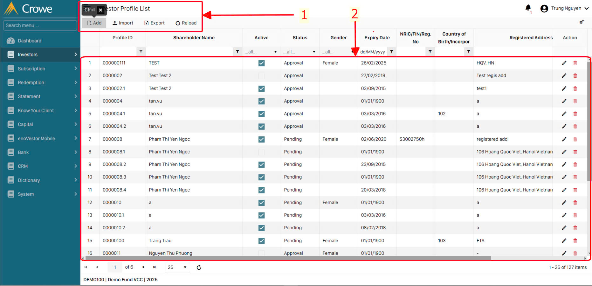
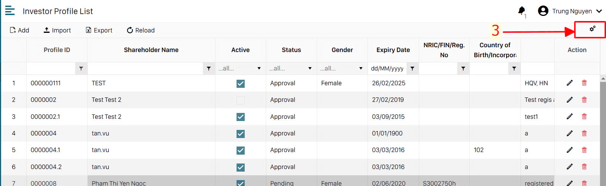
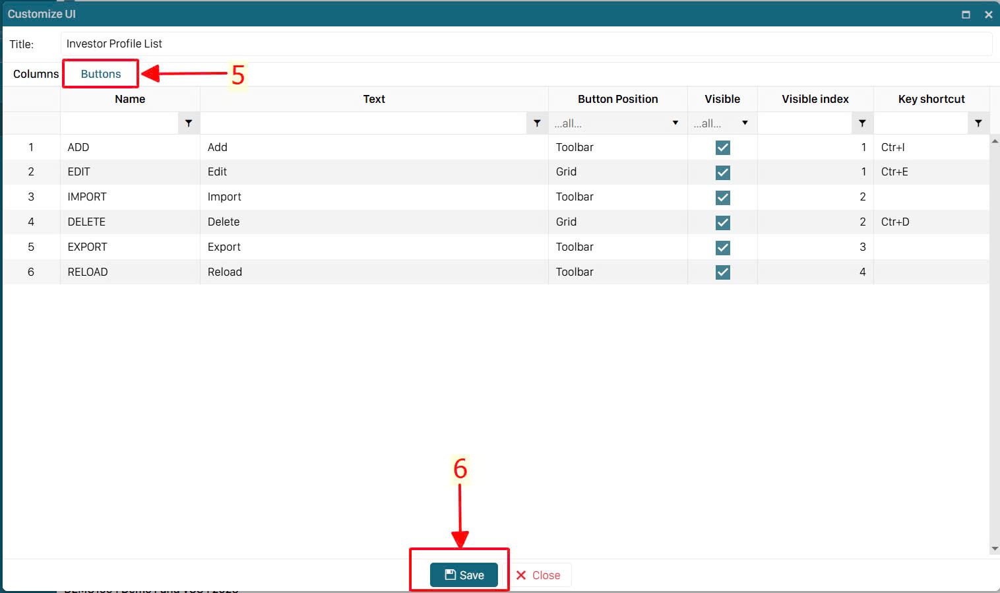

import Youtube from 'react-youtube';

# Các tiện ích cơ bản

Đây là các tiện ích cơ bản và được áp dụng với các danh mục và chứng từ. Ngoài các mục này thì các chứng từ có các tiện ích riêng sẽ được thể hiện chi tiết trong phần hướng dẫn của từng loại chứng từ riêng.

- ở bất kỳ 1 giao diện nào đều có thanh công cụ hướng dẫn các phím tắt nhanh (1)
- Để có thể sử dụng phím tắt nhanh, khi vào bất kỳ 1 giao diện nào các bạn cần bấm chuột trái 1 lần xuống phần chi tiết của giao diện (2) sau đó các bạn sử dụng các phím Ctrl+X, Ctrl+E, … để sử dụng phím tắt nhanh hỗ trợ nhập liệu.
- Các bạn có thể tùy chỉnh các nút hiển thị trên màn hình, bằng cách bấm chuột trái vào hình bánh răng ở góc trên bên phải màn hình

- Từ đây sẽ hiện lên bảng danh sách các nút phím tắt, cũng như các nút có trong module hiện tại, bạn có thể tùy chỉnh vị trí, hình thức, thứ tự xuất hiện của các nút. Đừng quên ấn Save để lưu lại trước khi đóng cửa sổ này

**Video hướng dẫn**:

<iframe width="100%" height="500px" src="https://www.youtube.com/embed/9QlsEboxjUQ?si=5BZAmMAkvuvubSGt" title="YouTube video player" frameborder="0" allow="accelerometer; autoplay; clipboard-write; encrypted-media; gyroscope; picture-in-picture; web-share" referrerpolicy="strict-origin-when-cross-origin" allowfullscreen></iframe>
