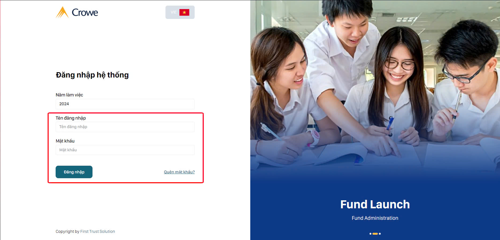
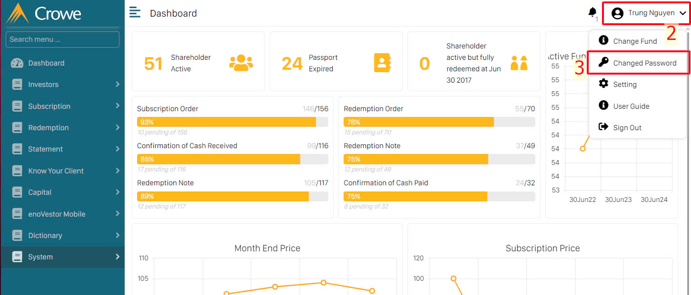
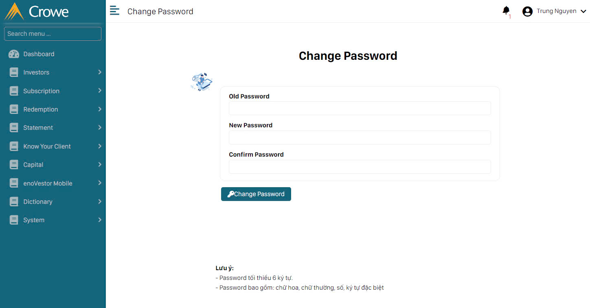

import Youtube from 'react-youtube';

# Thay đổi mật khẩu

## Nhập tài khoản

Truy cập vào website phần mềm qua đường dẫn **[Enovestor 2024](http://enovestor.fts.local/login)**.

## Vào mục thay đổi mật khẩu

Sau khi đăng nhập thành công, vào mục **Tên người dùng (2)** ở phía trên góc bên tay phải rồi chọn mục **Change Password (3)** có hình chìa khóa ở cạnh.

## Thay đổi mật khẩu

Khi màn hình chuyển sang giao diện **Thay đổi mật khẩu**, hãy nhập lại **Mật khẩu cũ - Old Password** để xác nhận đúng mật khẩu ban đầu, sau đó nhập **Mật khẩu mới - New password** và xác nhận lại mật khẩu mới ô **Confirm Password**.

Cuối cùng nhấn vào nút **Change Password** với hình
chìa khóa bên cạnh để cập nhật mật khẩu mới.

**Video hướng dẫn**:

<iframe width="800" height="500" src="https://www.youtube.com/embed/VIDEO_ID" frameborder="0" allowfullscreen></iframe>
